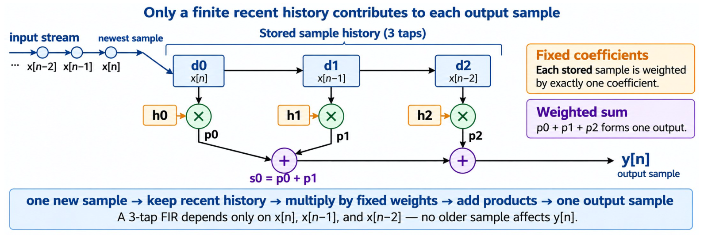

# Week 3. Combinatinal FIR Filter

## 1. Introduction

This project demonstrates the arithmetic portion of a three-tap finite impulse response (FIR) filter. The synthesizable RTL in `rtl/fir3_arith.v` computes one signed product for each stored sample and combines the products through an explicit two-adder chain. Its explicit signal widths and sign extension make the datapath behavior visible for review and simulation.

The project also illustrates the boundary between combinational FIR arithmetic and sequential sample storage. The delay-line values `d0`, `d1`, and `d2` are supplied to the arithmetic block; `tb_fir3_trace.v` models their movement for simulation and checking, but the repository does not yet implement a standalone sequential FIR module. Both Icarus Verilog and Vivado/XSim flows are provided for reproducing the simulations and examining the generated logs and waveforms.

## 2. Files

| File | Role | Student task |
|---|---|---|
| `rtl/fir3_arith.v` | Combinational three-tap multiply-and-add reference | Relate `d0/d1/d2`, `p0/p1/p2`, `s0`, and `y_out` to the architecture diagram. |
| `tb/tb_fir3_arith.v` | Unit test for the arithmetic block | Confirm the hand-calculated states produce `1,4,8,8,3`. |
| `tb/tb_fir3_trace.v` | Testbench-only state trace/checker | Observe zero reset history, reset release between edges, sample movement, and output formation. |
| `logs/` | Simulation log output folder | Inspect TRACE/PASS/FAIL/RESULT lines. |
| `waves/` | VCD waveform output folder | Inspect only the signals needed to support an explanation. |

## 3. FIR Filter

A finite impulse response (FIR) filter produces each output from a finite number of current and previous input samples. In this project, the three-tap datapath keeps the most recent samples in `d0`, `d1`, and `d2`, weights them with `h0`, `h1`, and `h2`, and adds the products to form one output sample:

- **Input stream:** the filter receives one sample at a time as `x[n]`.
- **Stored history:** delay registers retain the recent samples `x[n]`, `x[n-1]`, and `x[n-2]`.
- **Coefficients:** fixed values `h0`, `h1`, and `h2` weight the current and previous samples.
- **Output sample:** the weighted products are added to produce `y[n] = h0*x[n] + h1*x[n-1] + h2*x[n-2]`.
- **Finite impulse response:** only these three recent samples affect the current output; older samples no longer contribute.

<p align="center"></p>

In `rtl/fir3_arith.v`, the three products are exposed as `p0`, `p1`, and `p2`, the first addition is `s0 = p0 + p1`, and the final addition produces `y_out = s0 + p2`. The arithmetic block assumes that the delay-line values have already been stored, while `tb/tb_fir3_trace.v` demonstrates the sample-history movement for this Week 3 exercise. A complete clocked delay line remains part of the Week 4 sequential FIR task.

## 4. Hand Trace Stimuli

The hand-trace example uses:

- coefficients `h = [1, 2, 1]`;
- input sequence `x = 1, 2, 3, 0, 0`;
- `d0 = x[n]`, `d1 = x[n-1]`, `d2 = x[n-2]` after an accepted rising edge;
- simultaneous state update using old values: `d0_new = x_in`, `d1_new = d0_old`, `d2_new = d1_old`;
- combinational output `y_out = h0*d0 + h1*d1 + h2*d2`;
- expected output sequence `1, 4, 8, 8, 3`.
- A future `valid_out` should be interpreted in the Week 4 sequential FIR filter.

Expected trace values:

For `h = [1,2,1]` and `x = 1,2,3,0,0`:

| n | d0 | d1 | d2 | y_out |
|---|---:|---:|---:|---:|
| 0 | 1 | 0 | 0 | 1 |
| 1 | 2 | 1 | 0 | 4 |
| 2 | 3 | 2 | 1 | 8 |
| 3 | 0 | 3 | 2 | 8 |
| 4 | 0 | 0 | 3 | 3 |

## 5. Simulation Runs

### 5.1 Icarus Verilog

From the package root:

```bash
$ make
mkdir -p build/iverilog logs/iverilog waves/iverilog
iverilog -g2005 -o build/iverilog/tb_fir3_arith.vvp rtl/fir3_arith.v tb/tb_fir3_arith.v
vvp build/iverilog/tb_fir3_arith.vvp | tee logs/iverilog/fir3_arith_sim.log
VCD info: dumpfile waves/fir3_arith.vcd opened for output.
============================================================
Week 3 FIR arithmetic simulation started
Equation: y_out = h0*d0 + h1*d1 + h2*d2
Coefficients: h0=1 h1=2 h2=1
============================================================
[PASS] d0=1 d1=0 d2=0 -> p=[1,0,0] s0=1 y=1
[PASS] d0=2 d1=1 d2=0 -> p=[2,2,0] s0=4 y=4
[PASS] d0=3 d1=2 d2=1 -> p=[3,4,1] s0=7 y=8
[PASS] d0=0 d1=3 d2=2 -> p=[0,6,2] s0=6 y=8
[PASS] d0=0 d1=0 d2=3 -> p=[0,0,3] s0=0 y=3
[PASS] d0=-128 d1=-128 d2=-128 -> p=[-128,-256,-128] s0=-384 y=-512
============================================================
[RESULT] FIR3 ARITH TEST PASSED
============================================================
tb/tb_fir3_arith.v:95: $finish called at 16000 (1ps)
mkdir -p build/iverilog logs/iverilog waves/iverilog
iverilog -g2005 -o build/iverilog/tb_fir3_trace.vvp rtl/fir3_arith.v tb/tb_fir3_trace.v
vvp build/iverilog/tb_fir3_trace.vvp | tee logs/iverilog/fir3_trace_sim.log
VCD info: dumpfile waves/fir3_trace.vcd opened for output.
============================================================
Week 3 FIR hand-trace simulation started
Reset history begins at state [0,0,0]
============================================================
[PASS] reset state [d0,d1,d2]=[0,0,0]
[PASS] reset release does not capture a sample
[TRACE] n=0 x=1 state[d0,d1,d2]=[1,0,0] p=[1,0,0] y=1
[PASS] n=0 expected y=1
[TRACE] n=1 x=2 state[d0,d1,d2]=[2,1,0] p=[2,2,0] y=4
[PASS] n=1 expected y=4
[TRACE] n=2 x=3 state[d0,d1,d2]=[3,2,1] p=[3,4,1] y=8
[PASS] n=2 expected y=8
[TRACE] n=3 x=0 state[d0,d1,d2]=[0,3,2] p=[0,6,2] y=8
[PASS] n=3 expected y=8
[TRACE] n=4 x=0 state[d0,d1,d2]=[0,0,3] p=[0,0,3] y=3
[PASS] n=4 expected y=3
============================================================
Expected output sequence: 1, 4, 8, 8, 3
[RESULT] FIR3 TRACE TEST PASSED
============================================================
tb/tb_fir3_trace.v:144: $finish called at 76000 (1ps)
```

or:

```bash
$ bash scripts/run_icarus.sh

[INFO] Running FIR3 arithmetic simulation...
build/iveirlog/tb_fir3_arith.vvp: No such file or directory
error: Code generator failure: -1
tee: logs/iveirlog/fir3_arith_sim.log: No such file or directory
build/iveirlog/tb_fir3_arith.vvp: Unable to open input file.

[INFO] Running FIR3 hand-trace simulation...
build/iveirlog/tb_fir3_trace.vvp: No such file or directory
error: Code generator failure: -1
tee: logs/iveirlog/fir3_trace_sim.log: No such file or directory
build/iveirlog/tb_fir3_trace.vvp: Unable to open input file.

[INFO] Done. Logs are in logs/. VCD waveforms are in waves/.
```

Generated logs:

- `logs/fir3_arith_sim.log`
- `logs/fir3_trace_sim.log`

Generated waveforms:

- `waves/fir3_arith.vcd`
- `waves/fir3_trace.vcd`

### 5.2 Vivado/XSim

From the package root:

```bash
$ vivado -mode batch -source scripts/vivado/run_fir3_arith_xsim.tcl
$ vivado -mode batch -source scripts/vivado/run_fir3_trace_xsim.tcl
```

If the standalone XSim tools are already on `PATH`, you may instead run:

```bash
$ bash scripts/run_xsim_direct.sh
[INFO] Running fir3_arith with standalone XSim tools
[INFO] Running fir3_trace with standalone XSim tools
[INFO] XSim direct run complete. Check logs/ and waves/.
```

## 6. Conclusion

The Week 3 implementation makes the three-tap FIR datapath explicit: signed inputs and coefficients are multiplied independently, sign-extended intermediate values are added without losing width, and the final output is exposed as `y_out`. The arithmetic unit test also covers the signed-width boundary case and confirms that the reference RTL handles signed values as intended.

Together, the arithmetic and trace simulations validate the combinational reference, reset history, sample movement, and output formation used by the Week 3 hand-trace convention. Going forward, the best practice is to implement the Week 4 clocked delay line around this `fir3_arith` datapath and verify its `valid_in` and `valid_out` timing with a dedicated sequential testbench.
