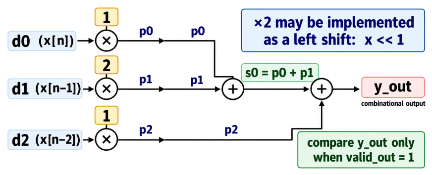

# Week 4. Sequential 3-tap FIR

## 1. Introduction

This project implements a sequential three-tap finite impulse response (FIR) filter using the fixed coefficient pattern `[1, 2, 1]`. The filter processes input samples in sequence, stores the most recent accepted samples, and calculates each output using a weighted sum. The project focuses on sequential RTL design, including sample-history management, reset operation, valid-data control, invalid-cycle handling, and signed-value processing. It also demonstrates how self-checking testbenches can be used to verify both the functionality and timing behavior of a hardware design.

## 2. Files

```text
rtl/fir3_seq.v                  synthesizable Week 4 FIR RTL
tb/tb_fir3_seq.v               main self-checking lab testbench
tb/tb_fir3_seq_signed.v        optional signed-width boundary sanity test
fir3_expected_outputs.txt      hand/reference results and exact testbench timing
scripts/run_icarus.sh          Icarus Verilog run script
scripts/run_icarus_signed.sh   optional signed-boundary run
scripts/run_xsim_direct.sh     Vivado/XSim direct run script
scripts/vivado/run_fir3_seq_xsim.tcl  XSim batch/waveform script
Makefile                        convenience targets
```

## 3. Baseline Architecture

- `d0` = newest accepted sample `x[n]`
- `d1` = previous accepted sample `x[n-1]`
- `d2` = sample from two accepted inputs earlier `x[n-2]`
- on a rising edge with `valid_in = 1`:
  - `d0_new = x_in`
  - `d1_new = d0_old`
  - `d2_new = d1_old`
- on a rising edge with `valid_in = 0`, `d0/d1/d2` hold
- `rst_n` is asynchronous active-low reset
- reset release by itself does **not** capture a sample
- `y_out` is **combinational** from the current stored state; no output register is assumed in the Week 4 baseline
- `valid_out` is registered control: it is `1` after an accepted edge and `0` after an invalid edge

For fixed coefficients `h = [1,2,1]`:

```
y_out = d0 + 2*d1 + d2
```

<p align="center"></p>

## 4. Expected Main Result

The accepted sample sequence is `1, 2, 3, 4, 5`; an invalid `x_in=99` cycle is deliberately inserted and must **not** advance the delay line.

Expected output:

```text
1, 4, 8, 12, 16
```

```text
[RESULT] FIR3_SEQ TEST PASSED
```

## 5. Simulation Runs

### Icarus Verilog Run

```
$ ./scripts/run_icarus.sh
VCD info: dumpfile waves/fir3_seq.vcd opened for output.
[PASS] reset asserted t=3000 d0=0 d1=0 d2=0 y=0 valid=0
[PASS] reset release does not capture input at t=23000
[PASS] post-reset hold t=26000 d0=0 d1=0 d2=0 y=0 valid=0
[PASS] accept x=1 t=36000 d0=1 d1=0 d2=0 y=1 valid=1
[PASS] accept x=2 t=46000 d0=2 d1=1 d2=0 y=4 valid=1
[PASS] ignore invalid x=99 t=56000 d0=2 d1=1 d2=0 y=4 valid=0
[PASS] accept x=3 t=66000 d0=3 d1=2 d2=1 y=8 valid=1
[PASS] accept x=4 t=76000 d0=4 d1=3 d2=2 y=12 valid=1
[PASS] accept x=5 t=86000 d0=5 d1=4 d2=3 y=16 valid=1
[PASS] final hold t=96000 d0=5 d1=4 d2=3 y=16 valid=0
[RESULT] FIR3_SEQ TEST PASSED
tb/tb_fir3_seq.v:130: $finish called at 100000 (1ps)
[PASS] Main Week 4 FIR simulation passed.
```

```
$ ./scripts/run_icarus_signed.sh
[pass] signed sample=-128 y=-128
[pass] signed sample=-128 y=-384
[pass] signed sample=-128 y=-512
[RESULT] FIR3_SEQ SIGNED TEST PASSED
tb/tb_fir3_seq_signed.v:58: $finish called at 50000 (1ps)
[PASS] Signed-width sanity simulation passed.
```

### Vivado/XSim Run

```
$ ./scripts/run_xsim_direct.sh

****** xsim v2025.2 (64-bit)
  **** SW Build 6299465 on Fri Nov 14 12:34:56 MST 2025
  **** IP Build 6300035 on Fri Nov 14 10:48:45 MST 2025
  **** SharedData Build 6298862 on Thu Nov 13 04:50:51 MST 2025
  **** Start of session at: Fri Oct  9 00:28:43 2026
    ** Copyright 1986-2022 Xilinx, Inc. All Rights Reserved.
    ** Copyright 2022-2025 Advanced Micro Devices, Inc. All Rights Reserved.

source xsim.dir/tb_fir3_seq_sim/xsim_script.tcl
# xsim {tb_fir3_seq_sim} -autoloadwcfg -tclbatch {scripts/vivado/run_fir3_seq_xsim.tcl}
Time resolution is 1 ps
source scripts/vivado/run_fir3_seq_xsim.tcl
## if {[catch {log_wave -recursive *} msg]} {
##     puts "WARN: log_wave failed: $msg"
## }
## run all
[PASS] reset asserted t=3000 d0=0 d1=0 d2=0 y=0 valid=0
[PASS] reset release does not capture input at t=23000
[PASS] post-reset hold t=26000 d0=0 d1=0 d2=0 y=0 valid=0
[PASS] accept x=1 t=36000 d0=1 d1=0 d2=0 y=1 valid=1
[PASS] accept x=2 t=46000 d0=2 d1=1 d2=0 y=4 valid=1
[PASS] ignore invalid x=99 t=56000 d0=2 d1=1 d2=0 y=4 valid=0
[PASS] accept x=3 t=66000 d0=3 d1=2 d2=1 y=8 valid=1
[PASS] accept x=4 t=76000 d0=4 d1=3 d2=2 y=12 valid=1
[PASS] accept x=5 t=86000 d0=5 d1=4 d2=3 y=16 valid=1
[PASS] final hold t=96000 d0=5 d1=4 d2=3 y=16 valid=0
[RESULT] FIR3_SEQ TEST PASSED
$finish called at time : 100 ns : File "/home/kaiden/EDA/w4/tb/tb_fir3_seq.v" Line 130
## quit
INFO: xsimkernel Simulation Memory Usage: 495984 KB (Peak: 549156 KB), Simulation CPU Usage: 820 ms
INFO: [Common 17-206] Exiting xsim at Fri Oct  9 00:28:46 2026...
[PASS] Week 4 FIR XSim run passed with a single VCD waveform.
```

## 6. Conclusion

The sequential three-tap FIR filter successfully produced the expected results for valid input samples while preventing invalid data from changing the stored sample history. The project showed that implementing a filter in RTL requires careful coordination between arithmetic operations, clocked state updates, reset behavior, and input-valid control. The passing simulations demonstrated correct operation for normal data, invalid cycles, reset conditions, final state holding, and signed boundary values. Overall, the project provided practical experience in designing, simulating, and verifying a sequential hardware signal-processing block.
