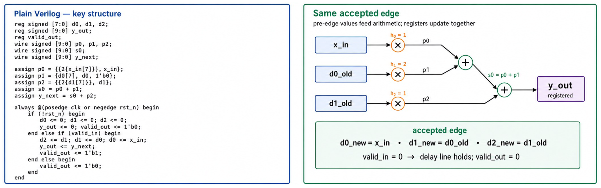

# Week 5. FIR Filter: Parallelism and Pipelining

## 1. Introduction

This project investigates parallelism and pipelining in a synchronous three-tap finite impulse response (FIR) filter with coefficients \(h=[1,2,1]\). Two plain-Verilog implementations are developed and verified: a registered parallel architecture that produces a result on the same accepted clock edge, and a two-stage pipelined architecture that registers the products before performing the final additions, introducing one cycle of latency. The designs use signed arithmetic, an active-low reset, and a valid handshake so that invalid input cycles do not alter the sample history or generate false outputs. Simulation testbenches exercise normal sequences, invalid-cycle bubbles, reset behavior, pipeline draining, and signed boundary values to confirm both functional correctness and the intended timing behavior.

## 2. FIR Behavior

- Coefficients: `h = [1, 2, 1]`.
- Signed 10-bit products, sums, and output are sufficient for this fixed coefficient set.
- Accepted-edge history: after an accepted rising edge, `d0=x[n]`, `d1=x[n-1]`, `d2=x[n-2]`.
- Arithmetic for a newly accepted sample uses `x_in`, `d0_old`, and `d1_old`.
- If `valid_in=0`, the delay line does not shift.

## 3. Implementations

### 3.1. `rtl/fir3_parallel.v`

Registered parallel 3-tap FIR. The accepted sample result is registered on the same accepted rising edge and `valid_out` is asserted for that result.

- Declare delay registers for previous samples.
- Compute products from current and delayed samples.
- Use a sufficiently wide sum signal.
- Register `y_out` and `valid_out` on clock edges.
- Keep reset behavior explicit and predictable.

<p align="center"></p>

### 3.2. `rtl/fir3_pipe2.v`

One-cycle pipelined FIR. Stage 1 registers products and `valid_s1`; Stage 2 adds stored products, registers `y_out`, and drives `valid_out` from the delayed valid bit.

- Stage 1 stores products and a delayed valid bit.
- Stage 2 adds stored products and produces output.
- Pipeline registers must be updated with nonblocking assignments.
- Output valid is delayed relative to input valid.
- The testbench checks both values and timing.

<p align="center"></p>

## 4. Simulator Run

```bash
$ ./scripts/run_all_xsim.sh
[PASS] fir3_parallel XSim completed
[PASS] fir3_pipe2 XSim completed
[RESULT] run_all_xsim.sh completed
```

or:

```bash
./scripts/run_all_iverilog.sh
```

## 5. Conclusion

The Week 5 implementations demonstrate two effective ways to structure the same three-tap FIR computation. The parallel design provides the shortest latency by calculating and registering the complete result for each accepted input, while the pipelined design separates product generation from addition to improve the potential timing of the datapath at the cost of one cycle of latency. The self-checking simulations confirmed the expected sequence \(y=[1,4,8,12,16]\), correct handling of invalid cycles, preservation of delay and product state during bubbles, correct output draining, and exact signed operation at the \(-512\) lower bound.

Going forward, always evaluate the trade-offs between alternative architectures before selecting an implementation. Parallel designs can provide high throughput and low latency but may require more hardware, pipelining can improve timing and clock frequency but adds latency and control complexity, and resource reuse can reduce area at the cost of lower throughput and potentially more involved scheduling. These choices should be assessed using the target application's latency and throughput requirements together with synthesis-based timing, area, and power measurements, while valid signals, reset behavior, signed widths, and pipeline latency are verified explicitly through self-checking tests.
